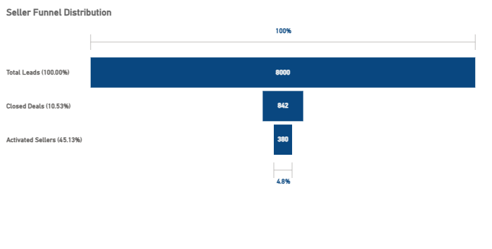
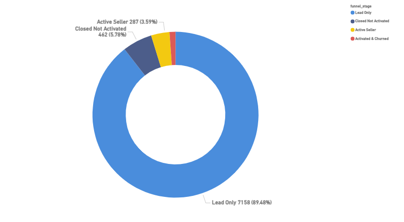
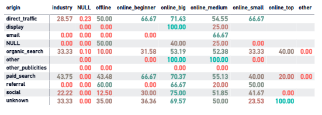
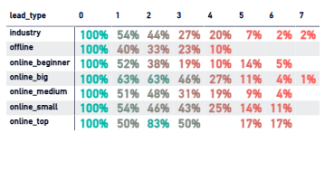
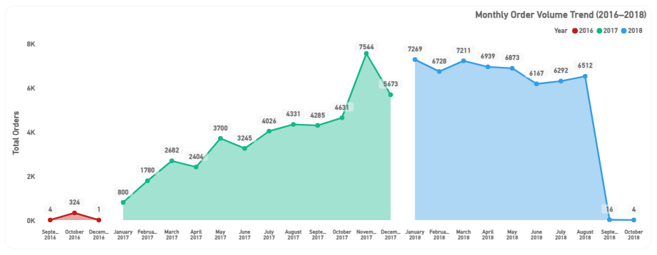
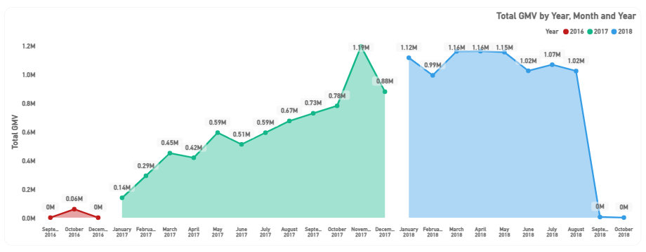
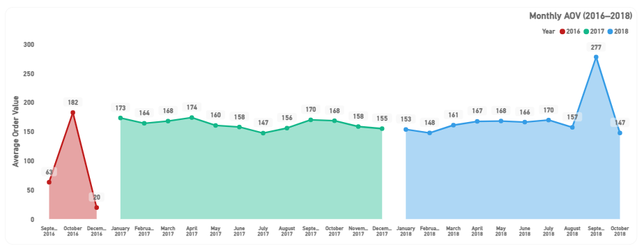

# olist-ecommerce-analytics
End-to-end SQL-based e-commerce analytics project covering funnel analysis, cohort retention, and RFM segmentation

# Olist E-Commerce Analytics Project

## Overview

This project analyzes an e-commerce marketplace using SQL, focusing on both **seller acquisition (supply side)** and **customer behavior (demand side)**.

## Dataset Overview

This project uses the **Brazilian E-Commerce Public Dataset by Olist**, combined with the **Olist Marketing Funnel Dataset**, covering both marketplace transactions and seller acquisition data.

---

### Core E-Commerce Tables

| Table Name     | Description               | Rows       |
|----------------|--------------------------|------------|
| customers      | Customer information     | 99,441     |
| orders         | Order-level data         | 99,441     |
| order_items    | Items per order          | 112,650    |
| order_payments | Payment transactions     | 103,886    |
| order_reviews  | Customer feedback        | 99,224     |
| products       | Product catalog          | 32,951     |
| sellers        | Seller information       | 3,095      |
| geolocation    | Location data            | ~1,000,000 |

---

### Marketing Funnel Tables

| Table Name                | Description              | Rows   |
|--------------------------|--------------------------|--------|
| marketing_qualified_leads| Incoming seller leads    | ~8,000 |
| closed_deals             | Converted seller leads   | ~800   |

---

### Data Scale

- Total Tables: 10  
- Total Records: ~1.5+ million rows  
- Time Range: 2016 – 2018  

---

### Data Modeling & Transformation

- Integrated multiple normalized tables into a structured analytics layer using PostgreSQL  
- Built a centralized **order-level fact table (`order_fact`)** to ensure metric consistency and eliminate duplication  
- Applied data validation checks to maintain data quality across joins and aggregations  
- Enabled efficient querying for business metrics such as GMV, retention, and seller funnel performance  

The analysis is divided into two major components:

1. Seller Funnel Analysis → Understanding seller acquisition, activation, and retention  
2. Marketplace Analysis → Understanding revenue, customer behavior, and operational performance  

The goal is to identify growth drivers, inefficiencies, and opportunities to improve retention and monetization.

---

## Data Pipeline Design

A structured SQL-based analytics pipeline was built:

- **Raw Layer** --> Data ingestion from multiple source tables  
- **Validation Layer** --> Data quality checks (referential integrity, revenue consistency)  
- **Analytics Layer** --> Business-ready views for reporting  

This ensures scalability, reliability, and clean separation of logic.

---

# 1. Seller Funnel Analysis

## Funnel Structure

Lead --> Closed Deal --> Activated --> Retained / Churned

---

## Seller Funnel Overview

### Insight
There is a steep drop-off across the funnel. Only a small percentage of leads convert into active sellers.

### Business Impact
The platform faces major inefficiencies in seller acquisition and onboarding, with significant leakage in early funnel stages.

---

## Funnel Stage Distribution

### Insight
A large majority of leads remain in the "Lead Only" stage, with very few progressing to activation.

### Business Impact
This indicates poor lead quality or ineffective conversion strategies at the top of the funnel.

---

## Lead Source & Seller Quality Analysis

### Insight
Different lead sources and segments show varying activation rates and revenue contribution.

### Business Impact
Seller quality depends heavily on acquisition channels. Optimizing high-performing sources can significantly improve funnel efficiency.

---

## Seller Lifecycle (Cohort by Lead Type)

### Insight
Retention patterns vary across seller segments, with premium lead types showing stronger retention.

### Business Impact
Seller quality at onboarding directly impacts long-term engagement and revenue generation.

---

## Key Seller Funnel Insights

- ~10% lead-to-deal conversion rate  
- Less than 50% of sellers become active  
- High drop-off in early funnel stages  
- Strong variation in seller quality across channels  
- Seller lifecycle quality depends on acquisition source  

---

# 2. Marketplace Analysis

This section focuses on customer behavior, revenue trends, and overall marketplace performance.

---

## 2.1 Order Volume Trend

### Insight
Order volume grew rapidly throughout 2017 and stabilized in 2018.

### Business Impact
The business transitioned from a high-growth phase to a more mature stage.

### Note
The sharp drop in the final months is due to incomplete data, not actual decline.

---

## 2.2 GMV (Revenue) Trend

### Insight
GMV closely follows order volume, showing strong growth in 2017 and stabilization in 2018.

### Business Impact
Revenue growth is driven by increasing transaction volume rather than higher customer spending.

---

## 2.3 Average Order Value (AOV)

### Insight
AOV remains relatively stable across the time period.

### Business Impact
Customer spending per order has not increased, indicating weak monetization.

### Note
A spike in one month is an outlier and not part of the overall trend.

---

## 2.4 Repeat Purchase Behavior

### Insight
Only ~3% of customers make repeat purchases.

### Business Impact
The platform is strong in acquisition but weak in retention, relying heavily on new customers for growth.

---

## 2.5 Cohort Retention Analysis

### Insight
Customer retention drops sharply after the first purchase, with very low repeat engagement.

### Business Impact
The marketplace behaves more like a one-time transaction platform rather than a habit-forming ecosystem.

---

## 2.6 RFM Segmentation

### Insight
A large proportion of customers fall into "Lost" or "At Risk" segments, while a small segment drives most revenue.

### Business Impact
Revenue is dependent on a limited group of high-value customers, creating concentration risk.

---

## 2.7 Customer Lifetime Value (CLV)

### Insight
Customer spending is highly skewed, with a small number of users contributing disproportionately to total revenue.

### Business Impact
Retention of high-value customers is critical for sustaining revenue.

---

## 2.8 Delivery Performance Analysis

### Insight
Customer satisfaction decreases as delivery delays increase.

### Business Impact
Operational inefficiencies directly impact customer experience and retention.

---

# Key Business Conclusions

- Growth is **volume-driven**, not value-driven  
- Heavy dependency on **new customer acquisition**  
- Extremely **low retention and repeat purchase rate**  
- Revenue concentrated among **few high-value customers**  
- Seller funnel shows **major inefficiencies in conversion and activation**  
- Delivery performance directly impacts customer satisfaction  

---

## Tools Used

- SQL (PostgreSQL)  
- Power BI  
- Excel  

---

## Future Scope

- Build interactive Power BI dashboards  
- Improve retention using cohort-based strategies  
- Optimize seller acquisition channels  
- Increase customer lifetime value through segmentation  
- Improve delivery efficiency and customer experience  
